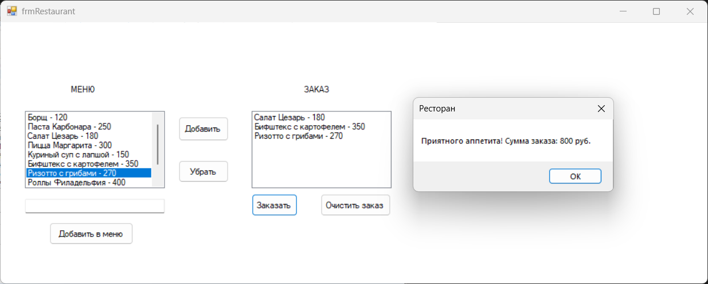

# Лабораторная работа 4

### Описание задания:
Разработайте приложение «Ресторан», которое будет
формировать заказ клиента с помощью двух элементов управления ListBox:
для меню и для заказа.

---
### Интерфейс главной формы (frmRestaurant.cs)

Название проекта: `Lab4`, название файла формы `frmRestaurant.cs`

---

### Инструментарий

| Объект              | Свойство `Name` |
|---------------------|-----------------|
| **Форма**           | `frmRestaurant` |
| **Cписок**          | `lstMenu`       |
| **Cписок**          | `lstZakaz`      |
| **Кнопка**          | `btnAdd`        |
| **Кнопка**          | `btnRemove`     |
| **Кнопка**          | `btnOk`         |
| **Текстовое поле**  | `txtNewDish`    |
| **Кнопка**          | `btnAddToMenu`  |
| **Кнопка**          | `btnClearOrder` |
| **Кнопка**          | `btnAddToMenu`  |
---
